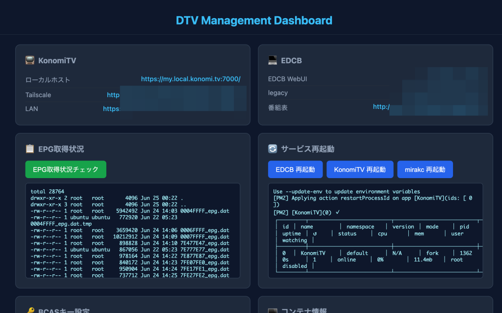

# mirakc-edcb-konomitv

mirakc + EDCB + KonomiTV を LXD コンテナ上に構築するためのインストールスクリプト集です。

- `tuner-lxd.sh` … ホスト側で実行するスクリプト（チューナードライバ、LXD コンテナ作成、Tailscale、USB チューナーパススルー）
- `install-mirakc-edcb-konomitv.sh` … コンテナ内で実行するスクリプト（mirakc / EDCB / KonomiTV の構築）

どちらのスクリプトも GitHub から取得して実行できます。B-CASキーやチャンネルデータなどの個人情報は **リポジトリには含めず、ホスト側のローカルにのみ保持** します。

## 動作環境

- ホスト: Ubuntu（LXD がインストール済み・`lxc` コマンドが使えること）
- チューナー: px4_drv 対応 USB チューナー（PLEX 等）
- コンテナ: Ubuntu 24.04/26.04

## インストール

### 1. リポジトリを取得

```bash
git clone https://github.com/hirogura/mirakc-edcb-konomitv.git ~/dtv
cd ~/dtv
```

（GitHub から直接実行する場合は、以下の `bash tuner-lxd.sh` を `bash <(curl -fsSL https://raw.githubusercontent.com/hirogura/mirakc-edcb-konomitv/main/tuner-lxd.sh)` に読み替えてください）

### 2. ホスト側スクリプトを実行

```bash
bash tuner-lxd.sh
```

実行内容:

1. チューナードライバ（px4_drv）のインストール（ダウンロード済みの .deb があれば再利用）
2. LXD コンテナ名の入力（デフォルト: `konomitv`）
3. Tailscale の authkey 入力（任意）
4. コンテナの作成・`/opt/lxd-data` のマウント・ID マッピング（1000:1000）設定
5. コンテナ内の apt 更新・Tailscale インストール
6. Tailscale 起動
7. スナップショット `TailscaleOK` 作成（任意）
8. USB チューナーのコンテナへのパススルー（任意）
9. スナップショット `TunerOK` 作成（任意）
10. インストールスクリプトを GitHub からコンテナ内（`/root/install-mirakc-edcb-konomitv.sh`）に取得

取得後、「今すぐインストールスクリプトを実行しますか？」と聞かれるので `Y` を選択すると、そのままコンテナ内でインストールが開始されます。`n` を選んだ場合はコンテナ内のシェルに入るので、後から以下を実行してください。

```bash
bash ~/install-mirakc-edcb-konomitv.sh
```

### 3. コンテナ内でインストールスクリプトを実行

```bash
bash ~/install-mirakc-edcb-konomitv.sh
```

実行内容:

1. B-CAS キーの入力（バックアップがあれば復元するか確認）
2. 依存パッケージのインストール
3. 復号ライブラリ libyakisoba / libsobacas のビルド
4. Rust ツールのビルド（recisdb / mirakc）
5. mirakc-arib のビルド
6. チャンネルスキャン（ISDBScanner）
7. mirakc のセットアップ（EPG / サービススキャン）
8. EDCB（EpgTimerSrv）のセットアップ
9. KonomiTV のインストール

### 4. DTV管理ダッシュボードのインストール（任意）

KonomiTV のセットアップが完了した後、Web ブラウザから各種操作ができる管理ダッシュボードをインストールできます。

- EDCB / KonomiTV / mirakc の再起動
- B-CAS キーの編集（保存すると mirakc を自動再起動）
- EPG 取得状況の確認
- チャンネルスキャンの再実行（ISDBScanner → mirakc / EDCB のチャンネル設定へ自動反映）
- KonomiTV のアップデート（ブラウザ上のターミナルからインストーラーと対話。nvm 環境で pm2 への PATH が通らない問題も自動修正）
- DTV 関連のバックアップ実行（`konomitv-backup.sh`）



コンテナ内で以下を実行してください。

```bash
bash <(curl -fsSL https://raw.githubusercontent.com/hirogura/mirakc-edcb-konomitv/main/install-dtv-manage.sh)
```

実行内容:

1. 必要なファイル（`konomitv-backup.sh` / `dtv-rescan.sh` / `konomitv-update.sh` / `server.py` / `index.html`）を `/opt/dtv-manage` に配置
2. systemd サービス `dtv-manage` を登録・起動（ポート 80 で HTTP サーバーを立ち上げ）

インストール完了後、`http://<コンテナのIPアドレス>/` にアクセスするとダッシュボードが表示されます。

### バックアップからの復元（任意）

ホストの `/opt/lxd-data/konomitv-backup`（または `/opt/lxd-data/リネーム`）に、
B-CASキー・ビルド済みバイナリ・チャンネルスキャン結果・EPGデータ等が残っている場合は、
インストール時に「バックアップを使用しますか？」と聞かれるので、必要に応じて選択してください。
これにより長いビルドや再スキャンを省略できます。

## アンインストール

### 1. コンテナ内のサービスを停止・削除

```bash
lxc exec konomitv -- bash
# コンテナ内で実行
pm2 delete KonomiTV 2>/dev/null; sudo systemctl stop edcb mirakc 2>/dev/null
sudo systemctl disable edcb mirakc 2>/dev/null
sudo rm -f /etc/systemd/system/edcb.service /etc/systemd/system/mirakc.service
sudo systemctl daemon-reload
```

### 2. コンテナ内にインストールしたファイルを削除

```bash
# コンテナ内で実行
sudo rm -rf /opt/KonomiTV /var/local/edcb /var/lib/mirakc /etc/mirakc ~/dtv ~/update-epg.sh
sudo rm -f /usr/local/bin/{mirakc,mirakc-arib,recisdb,EpgTimerSrv,isdb-scanner,epgcapture,EpgTimer}
sudo rm -rf /usr/local/lib/edcb
sudo rm -f /usr/local/etc/bcas_keys
sudo rm -f /usr/local/lib/libyakisoba* /usr/local/lib/libsobacas*
sudo ldconfig
exit
```

### 3. LXD コンテナを削除（ホスト側）

```bash
lxc stop konomitv
lxc delete konomitv
```

コンテナにパススルーしていた USB デバイス設定も、コンテナ削除とともに解除されます。

### 4. チューナードライバの削除（ホスト側・任意）

```bash
sudo apt remove px4-drv-dkms
sudo modprobe -r px4_drv
```

## 再スキャン（チャンネルが表示されない場合）

コンテナ内で実行:

```bash
bash ~/install-mirakc-edcb-konomitv.sh --rescan-only
```

## 注意事項

- 本リポジトリのファイルは、B-CAS カードを契約・所有し、個人的利用の範囲でのみ使用してください。

## ライセンス

このプロジェクトは [MIT License](LICENSE) の下で公開されています。
